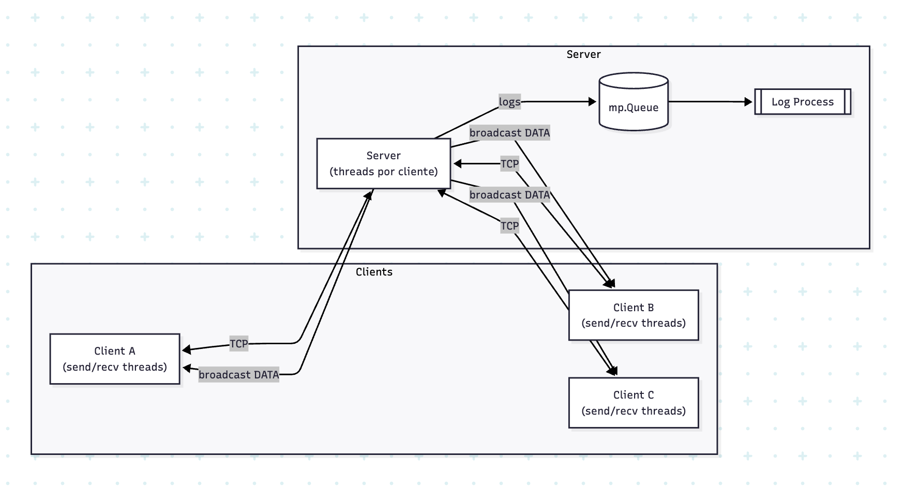

# Chat Distribuído com Confiabilidade, Fragmentação e Concorrência

**Autores:** Rafael Andrade Leite Barros, Miguel de Souza Batista, Tiago Gurgel Amorim Ferreira de Abreu, Vinicius Diniz Amorim Simões  
**Licença:** Uso acadêmico / educativo  
**Status:** MVP funcional

---

## Sumário
- [Visão Geral](#visão-geral)
- [Principais Recursos](#principais-recursos)
- [Arquitetura](#arquitetura)
- [Estrutura do Projeto](#estrutura-do-projeto)
- [Requisitos](#requisitos)
- [Configurações do Protocolo](#configurações-do-protocolo)
- [Instalação e Execução Rápida](#instalação-e-execução-rápida)
- [Modos de Execução do Cliente](#modos-de-execução-do-cliente)
- [Execução em Rede Local](#execução-em-rede-local)
- [Uso do Cliente](#uso-do-cliente)
- [Detalhes do Protocolo](#detalhes-do-protocolo)
- [Fragmentação e Confiabilidade](#fragmentação-e-confiabilidade)
- [Threads, Processo de Log e IPC](#threads-processo-de-log-e-ipc)
- [Logs](#logs)
- [Teste Rápido](#teste-rápido)
- [Erros Comuns / Troubleshooting](#erros-comuns--troubleshooting)
- [Próximos Passos / Extensões](#próximos-passos--extensões)
- [Documento Acadêmico](#documento-acadêmico)
- [Aviso](#aviso)

---

## Visão Geral
Chat distribuído sobre TCP com:
- Handshake customizado (SYN / SYN-ACK / ACK)
- Fragmentação e remontagem
- Janela deslizante + ACK/NACK
- Servidor multithread
- Processo independente de logging

---

## Principais Recursos
- Broadcast confiável
- Apelidos dinâmicos
- Protocolo binário com checksum
- Separação de camadas (rede / UI / core)
- Log assíncrono (Queue + processo)

---

## Arquitetura
Visualização do diagrama:



Fonte editável (Excalidraw):
- Arquivo: `docs/diagrama-arquitetura.excalidraw`
- Como abrir/editar: acessar https://excalidraw.com → Menu (☰) → Abrir (Open) → selecionar o arquivo OU arrastar o `.excalidraw` para o canvas.
- Após editar: Export → PNG/SVG e sobrescrever `docs/diagrama-arquitetura.png`.

Fluxo: Cliente ↔ Servidor (threads) ↔ Queue ↔ Processo de Log → Arquivo  
Mensagens: fragmentação → envio sequencial (janela) → ACKs → remontagem → broadcast.

---

## Estrutura do Projeto
```
ThreadCenter/
├── docs/
│   ├── diagrama-arquitetura.png
│   └── Trabalho_Fccpd.pdf
├── logs/
│   └── server.log
├── src/
│   ├── server.py
│   ├── client.py
│   ├── network_device.py
│   ├── terminal_ui.py
│   └── core/
│       └── settings.py
└── README.md
```

---

## Requisitos
- Python 3.8+ (recomendado 3.10+)
- Apenas biblioteca padrão
- macOS / Linux testados (Windows provável compatível)

Verificar:
```bash
python3 --version
```

---

## Configurações do Protocolo
Arquivo: `src/core/settings.py`
- HOST_PADRAO
- PORTA_PADRAO
- TAMANHO_FRAGMENTO
- TIMEOUT_ACK
- TAMANHO_JANELA
- RETRIES_MAX

Alterar porta:
1. Editar `settings.py`
2. Reiniciar servidor
3. Conectar clientes com a nova porta

---

## Instalação e Execução Rápida
Servidor:
```bash
python3 src/server.py
```
Cliente (CLI padrão):
```bash
python3 src/client.py
```
Encerrar: Ctrl + C.

---

## Modos de Execução do Cliente
(Confirme nomes das flags conforme implementação de argparse; ajuste se divergir.)

1. CLI Interativo Padrão:
```bash
python3 src/client.py
```

2. Modo UI (usa `terminal_ui.py`):
```bash
python3 src/client.py --mode ui
```

3. Host e Porta explícitos:
```bash
python3 src/client.py --host 192.168.0.25 --port 5001
```

4. Definir apelido na inicialização:
```bash
python3 src/client.py --nick Ana
```

5. Enviar uma única mensagem e sair:
```bash
python3 src/client.py --send "Teste rápido" --host 127.0.0.1 --port 5001
```

6. Enviar conteúdo de arquivo (broadcast):
```bash
python3 src/client.py --file ./mensagem_longa.txt
```

7. Silencioso (logs mínimos):
```bash
python3 src/client.py --quiet
```

8. Ajustar janela e fragmento em runtime (se exposto):
```bash
python3 src/client.py --window 5 --frag-size 512
```

9. Variáveis de ambiente:
```bash
HOST=127.0.0.1 PORT=5001 python3 src/client.py
```

10. Virtualenv:
```bash
python3 -m venv .venv
source .venv/bin/activate
python src/server.py
```

---

## Execução em Rede Local
Servidor:
```bash
python3 src/server.py
```
Descobrir IP:
```bash
ifconfig | grep inet   
```
Cliente remoto:
```bash
python3 src/client.py --host 192.168.x.x --port 5001
```
Liberar porta no firewall se necessário.

---

## Uso do Cliente
Digite mensagens e Enter envia.

Comandos (exemplos):
- `/who` lista usuários
- `/nick <novo>` altera apelido

---

## Detalhes do Protocolo
Cabeçalho (exemplo lógico):
- version (1 byte)
- type (1 byte)
- seq (4 bytes)
- total_frags (2)
- frag_index (2)
- payload_length (2)
- checksum (2)
- payload (variável)

Tipos (proposta):
0 SYN, 1 SYN-ACK, 2 ACK, 3 DATA, 4 NACK, 5 CLOSE

Handshake 3 vias antes de DATA.

Checksum: soma modular / CRC simples (ver `network_device.py`).

---

## Fragmentação e Confiabilidade
- Mensagens maiores que `TAMANHO_FRAGMENTO` são divididas
- Envio dentro de janela (TAMANHO_JANELA)
- ACK por fragmento
- Retransmissão em timeout até `RETRIES_MAX`
- NACK acelera recuperação (quando usado)
- Montagem ordenando `frag_index`

---

## Threads, Processo de Log e IPC
Servidor:
- Thread principal aceita conexões
- Thread por cliente gerencia I/O
- Estruturas compartilhadas com Lock

Logging:
- Processo separado via `multiprocessing.Process`
- Comunicação por `Queue`
- Escrita não bloqueia threads de rede

---

## Logs
Arquivo: `logs/server.log`
Visualizar:
```bash
tail -f logs/server.log
```
Contém timestamps, eventos e erros.

---

## Teste Rápido
1. Iniciar servidor
2. Abrir 2+ clientes
3. Enviar texto > 2000 chars
4. Verificar recepção completa
5. Rodar `/who`
6. Alterar apelido `/nick teste123`
7. Fechar um cliente abrupto (Ctrl + C) e observar remoção

---

## Erros Comuns / Troubleshooting
Porta ocupada:
```bash
lsof -i :5001
kill -9 <PID>
```
Sem conexão: validar IP, firewall, porta.  
Mensagem truncada: revisar `TAMANHO_FRAGMENTO`.  
Sem log: conferir permissões em `logs/`.  
Timeouts frequentes: reduzir `TAMANHO_FRAGMENTO` ou aumentar `TIMEOUT_ACK`.

---

## Próximos Passos / Extensões
- Criptografia (TLS / camada simétrica)
- Autenticação e autorização
- Compressão de payload
- Salas / canais
- Testes automatizados (pytest)
- Rotação de logs
- Web gateway (WebSocket)
- Métricas (Prometheus / expor endpoint)

---

## Documento Acadêmico
Acesse o documento completo: [Relatório Técnico / Documento Acadêmico](https://docs.google.com/document/d/1aA1QmeW1j2qxlBuGpSKtdN1jDiYI1magjSzCE7CvJdo/edit?tab=t.0)

---

## Aviso
Projeto acadêmico; não auditado para produção. Revisar segurança antes de exposição pública.

---